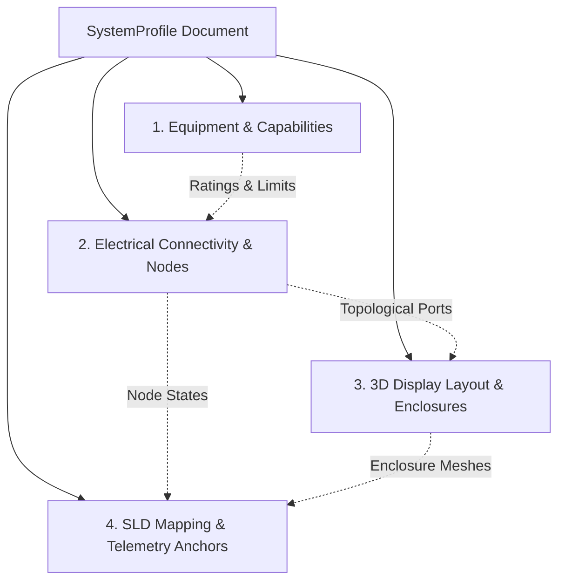

# SystemProfile Data Contract & Multi-System Architecture Specification

**Standard Reference:** HYB-FA-001 Rev B / IEC 60364-7-712 / PLAN.md Phase 7 (§7.0–§7.9)  
**Version:** `1.0.0`  
**Status:** Approved Reference Contract  
**Canonical Implementation:** [`js/system-profile.js`](file:///c:/Users/smont/Desktop/my/shahrivar/23/APP/APP/17/js/system-profile.js)  
**Canonical Document:** `profile-hyb-1p-5kw-v1`  

---

## 1. Executive Summary & Design Principles

The 3D Solar Simulator historically operated as a hardcoded 5 kW single-phase hybrid system with 310 static `Vector3` coordinates and scalar power calculations. To support the owner's requirement of **6 system families** (Single-phase up to 10 kW and Three-phase 5–100 kW across Hybrid, On-Grid, and Off-Grid configurations), the architecture is decoupled into a data-driven contract: `SystemProfile`.

### Core Architectural Rules (PLAN.md §7.0 & §7.3)
1. **Structural Decoupling, Not Parametric Hiding:** An off-grid or on-grid model is not simply a hybrid model with hidden meshes. Topologies differ in protection schemes, earthing arrangements, relay logic, and busbars.
2. **Approved Configurations Only:** Power rating does not imply a single equipment arrangement. Arbitrary sliders (e.g., free 5–100 kW sliders guessing string counts or battery racks) are prohibited. Each family defines discrete, engineer-approved configurations.
3. **No Topology Inference From Names:** Equipment presence (battery, EPS, bypass, ATS, isolators) is governed strictly by the owner's Single Line Diagram (SLD) and equipment catalogue—never assumed by labels such as "off-grid".
4. **Zero Side Effects on Existing App:** In Step 15a, the contract is purely declarative and validated. Existing simulation routines and 3D scenes continue to operate without alteration.

---

## 2. The 4 Decoupled Domains (§7.3)

Every `SystemProfile` document must strictly segregate its data into four isolated domains:



### Domain 1: Equipment & Capabilities (`equipment`)
* **Purpose:** Defines physical catalogue items, nameplate ratings, operating limits, port definitions, and internal switchgear.
* **Invariant:** Contains **no** spatial 3D coordinates and **no** SVG presentation logic.
* **Core Entities:**
  * `pvArray`: Module specifications (Voc, Vmp, Isc, Imp), string counts, temperature coefficients.
  * `dcCombinerBox`: gPV fuse ratings, DC-PV2 isolator switches, Type 2 DC SPDs, PE busbars.
  * `inverter`: Continuous AC power, MPPT voltage ranges, internal stages (MPPT, DC link bus, bidirectional DC-DC, SPWM bridge), internal safety relays (KSEP anti-islanding, KNE neutral-earth bond, RCMU).
  * `batteryStorage`: Chemistry (LiFePO4), cell topology, nominal voltage/capacity, max charge/discharge power, BMS thresholds.
  * `batteryDisconnect`: DC MCB/OCPD ratings, integrated pre-charge resistor parameters.
  * `earthingMet`: Main Earthing Terminal solid copper bar, electrode resistance.
  * `mainDistributionBoard`: Q0 incoming MCB, bidirectional Smart Energy Meter (SDM230), CT sensor, QG inverter grid MCB, QBP bypass MCB, QN normal load MCB, FSPD, AC SPD Type 2, BUS-G busbar.
  * `epsDistributionBoard`: QE inverter EPS MCB, SBY 3-position break-before-make rotary changeover switch, QO critical load incomer, 30mA Type A RCD/RCBO, isolated neutral bar.
  * `loadClusters`: Normal sheddable loads vs. critical uninterruptible loads.

### Domain 2: Electrical Connectivity & Nodes (`connectivity`)
* **Purpose:** Represents the topological graph of electrical buses, circuits, conductors, safety interlocks, and protection loops.
* **Invariant:** Must not depend on 3D geometry or cable color styling.
* **Core Entities:**
  * `buses`: Named electrical potential nodes (`BUS-G`, `DC-BUS`, `BUS-EPS`, `MET`, `MDB-N`, `EPS-N`).
  * `circuits`: Functional circuit pathways (`pv1_dc_string`, `battery_dc_feeder`, `utility_service_incomer`, `inverter_grid_coupling`, `grid_bypass_feeder`, `inverter_eps_feeder`, `critical_loads_feeder`, `earthing_network`) with rated current, power capacity, and wire gauges.
  * `interlocks`:
    * `INTLK_SBY_BBM`: Break-Before-Make mutual exclusion between EPS Port (I) and Grid Bypass (II).
    * `INTLK_ANTI_ISLANDING_KSEP`: <20ms utility decoupling upon blackout.
    * `INTLK_NEUTRAL_EARTH_KNE`: Islanding neutral grounding bond to establish functional fault loop for RCD.

### Domain 3: 3D Display Layout & Enclosures (`layout3D`)
* **Purpose:** Enclosure spatial coordinates, bounding boxes, mounting styles, camera presets, and 3D cable trajectories.
* **Invariant:** Contains **no** electrical logic or power calculation formulas.
* **Core Entities:**
  * `room`: Overall room dimensions (width, height, depth, wall plane, floor level).
  * `enclosures`: Coordinates `(X, Y, Z)`, dimensions `(W, H, D)`, mounting bracket types, door hinge specifications, and floating telemetry badge anchor offsets.
  * `cameraFraming`: Bounding boxes for automatic camera framing and viewpoints (`OVERVIEW`, `ROOFTOP`, `DC_PROTECTION`, `INVERTER`, `BATTERY`, `MDB_GRID`, `EPS_BACKUP`, `CT_SENSING`, `EARTHING_MET`).
  * `cabling3D`: 3D CatmullRom spline control points, tube radii, aesthetic color hexes, and **rated power capacity** (mitigating defect **V13** by normalizing particle flow speed against path capacity).

### Domain 4: SLD Mapping & Telemetry Anchors (`sldMapping`)
* **Purpose:** Decouples the schematic drawing from internal simulator IDs. Resolves drawing identifiers to model variables without requiring the owner to redraw schematics.
* **Invariant:** Contains SVG DOM IDs, blade selectors, telemetry anchor elements, and flow overlay IDs.
* **Core Entities:**
  * `symbolMapping`: Mapping dictionary linking internal breaker/switch states (`q0_mcb`, `qg_mcb`, `qn_mcb`, `qbp_mcb`, `dc_iso_1`, `battery_qb`, `qe_mcb`, `sby_switch`, `qo_mcb`, `eps_rcd`) to SVG DOM elements, blade lines, rotation/transforms, and Persian labels.
  * `telemetryAnchors`: Binding DOM element IDs (`sld-telemetry-pv`, `sld-telemetry-bat`, `sld-telemetry-grid`, `sld-telemetry-eps`) to formatters.
  * `flowOverlays`: SVG flow lines activated conditionally based on power model results.

---

## 3. Schema & Field Definitions

### Top-Level Contract Schema

```typescript
interface SystemProfile {
  id: string;                         // Unique canonical slug, e.g. "profile-hyb-1p-5kw-v1"
  name: string;                       // Persian display name
  nameEn: string;                     // English technical name
  version: string;                    // Semantic version, e.g. "1.0.0"
  schemaVersion: "1.0.0";             // Contract schema version
  familyId: SystemFamilyId;           // One of the 6 approved family IDs
  description?: string;               // Technical profile description
  
  family: {
    familyId: SystemFamilyId;
    familyNameFa: string;
    familyNameEn: string;
    phaseCount: 1 | 3;                // Single-phase (1) or Three-phase (3)
    phases: ("L1" | "L2" | "L3")[];  // ['L1'] or ['L1', 'L2', 'L3']
    neutralPresent: boolean;
    pePresent: boolean;
    topology: "hybrid" | "on-grid" | "off-grid";
    earthingSystem: "TN-S" | "TN-C-S" | "TT" | "IT";
  };
  
  status: "active" | "awaiting_sld" | "draft" | "validated";
  
  sldRef: {
    drawingId: string;                // e.g. "SLD-01", "SLD-02"
    titleFa: string;
    standard: string;                 // e.g. "HYB-FA-001"
    revision: string;                 // e.g. "Rev B"
    date: string;                     // ISO Date
    requiresOwnerRedraw: boolean;     // False by contract (intake mapping handles differences)
  };
  
  systemRatings: SystemRatings;       // Nameplate ratings with explicit units
  equipment: Record<string, EquipmentItem>;
  connectivity: SystemConnectivity;
  layout3D: SystemLayout3D;
  sldMapping: SystemSldMapping;
}
```

### System Ratings Contract (`systemRatings`)
All electrical properties MUST specify their physical units directly in the property name:

| Field Name | Type | Unit | Description |
|---|---|---|---|
| `acRatedPower_W` | `number` | Watts (W) | Nominal continuous inverter AC output power |
| `acMaxApparentPower_VA` | `number` | Volt-Amps (VA) | Maximum continuous AC apparent power |
| `acNominalVoltage_V` | `number` | Volts (V) | Nominal Line-to-Neutral voltage (230V) |
| `acVoltageRange_V` | `{ min: number, max: number }` | Volts (V) | Permitted utility grid voltage operating envelope |
| `acNominalFrequency_Hz` | `number` | Hertz (Hz) | Nominal system frequency (50.0 Hz) |
| `acRatedCurrent_A` | `number` | Amperes (A) | Rated continuous AC current per phase |
| `dcRatedTotalPower_W` | `number` | Watts (W) | Total STC rated capacity of all PV strings |
| `dcStringCount` | `number` | count | Total quantity of independent PV strings |
| `dcStringNominalVoc_V` | `number` | Volts (V) | Nominal string open-circuit voltage at 25°C |
| `dcMpptVoltageRange_V` | `{ min: number, max: number }` | Volts (V) | Inverter MPPT tracking voltage limits |
| `batteryPresent` | `boolean` | flag | Indicates physical presence of BESS |
| `batteryNominalCapacity_Wh` | `number` | Watt-hours (Wh) | Total usable storage capacity |
| `batteryNominalVoltage_V` | `number` | Volts (V) | Nominal DC bus voltage of battery pack |
| `batteryMaxChargePower_W` | `number` | Watts (W) | Maximum battery charging intake rate |
| `batteryMaxDischargePower_W`| `number` | Watts (W) | Maximum battery discharge capability |
| `epsRatedPower_W` | `number` | Watts (W) | Continuous backup power rating on EPS port |
| `epsMaxOverloadPower_W` | `number` | Watts (W) | Overload cutoff threshold for critical loads |
| `epsTransferTime_ms` | `number` | Milliseconds | Grid-to-island transfer duration (<= 10ms) |

---

## 4. The 6 System Families Matrix

Per PLAN.md Phase 7, the project targets six distinct architectural families. Each family is identified by an immutable `familyId` and must provide approved discrete configurations:

```
+-------------------------------------------------------------------------------+
|                             SYSTEM FAMILIES                                   |
+------------------------------------+------------------------------------------+
| SINGLE-PHASE (Up to 10 kW)         | THREE-PHASE (5 to 100 kW)                |
+------------------------------------+------------------------------------------+
| 1. 1p-hybrid                       | 4. 3p-hybrid                             |
|    - Dual MPPT, Battery, SBY/ATS   |    - 3-Phase 400V/230V, Battery, ATS     |
|    - Reference: profile-hyb-1p-5kw |    - SLD-02 baseline                     |
|                                    |                                          |
| 2. 1p-ongrid                       | 5. 3p-ongrid                             |
|    - No Battery, No EPS, No SBY    |    - Commercial rooftop / ground-mount   |
|    - Direct Grid tie               |    - Grid injection only                 |
|                                    |                                          |
| 3. 1p-offgrid                      | 6. 3p-offgrid                            |
|    - Battery mandatory, No Grid    |    - Island microgrid / generator backup |
|    - Dedicated local N-PE bond     |    - Synchronized inverter cluster       |
+------------------------------------+------------------------------------------+
```

### Family Comparison & Requirements Table

| Family ID | Phases | Power Envelope | Battery | Grid Port | EPS / Backup | Changeover | Earthing & Bonding | Target SLD |
|---|---|---|---|---|---|---|---|---|
| `1p-hybrid` | 1 (L1) | 3 kW – 10 kW | Optional/Present | Yes | Yes (Dedicated) | SBY (I-0-II) / ATS | TN-S, MET busbar, KNE bond | SLD-01 (Rev B) |
| `1p-ongrid` | 1 (L1) | 1.5 kW – 10 kW | None | Yes | None | None | TN-C-S / TN-S, MET | SLD-1P-OG (TBD) |
| `1p-offgrid`| 1 (L1) | 3 kW – 10 kW | Mandatory | None / Gen | Continuous Main | None / Gen ATS | Local TT or TN with permanent N-PE bond | SLD-1P-OFF (TBD) |
| `3p-hybrid` | 3 (L1,L2,L3) | 5 kW – 100 kW | Present | Yes (400V) | Yes (4P 400V) | 4P ATS (KG/KE interlocked) | TN-S, 4P protection, PMR monitoring | SLD-02 (Rev B) / SLD-03 |
| `3p-ongrid` | 3 (L1,L2,L3) | 10 kW – 100 kW | None | Yes (400V) | None | None | TN-S / TN-C-S, Zero-export CT/meter | SLD-3P-OG (TBD) |
| `3p-offgrid`| 3 (L1,L2,L3) | 10 kW – 100 kW | Mandatory | None / Gen | Continuous 3P | Generator ATS | Local Earth, 4P isolation, Neutral grounding | SLD-3P-OFF (TBD) |

---

## 5. Three-Phase Architecture Principles (§7.5)

Supporting three-phase systems is an electrical power model evolution, not a simple "multiply by 3" scalar factor:

1. **Per-Phase Data Shape From Day One:**
   The telemetry and state shape must support `L1`, `L2`, and `L3` individually:
   ```javascript
   grid: {
     vL1: 230, vL2: 230, vL3: 230,
     vL1L2: 400, vL2L3: 400, vL3L1: 400,
     pL1: 3333, pL2: 3333, pL3: 3333,
     pTotal: 10000,
     isBalanced: true
   }
   ```
2. **Derived Quantities:**
   * Total AC power is always derived from the sum of the phase powers: \(P_{\text{total}} = P_{L1} + P_{L2} + P_{L3}\).
   * Line-to-line voltages are derived from line-to-neutral voltages: \(V_{LL} = \sqrt{3} \cdot V_{LN}\).
3. **DC & Storage Independence:**
   Voltages on the DC bus and battery storage do **not** triple. A 50 kW 3-phase inverter may utilize a high-voltage battery (e.g., 400V–800V DC) rather than a 48V bank, but this is governed by the equipment specification, not phase count.
4. **Honest Unbalanced Load Tagging:**
   Until unbalanced load solver routines are implemented and verified, systems assume balanced loading and explicitly label it in UI telemetry: `«بار متعادل (پیش‌فرض)»`. Unmodelled behaviors are labeled `«مدل نشده»`—never displayed as misleading zeros.

---

## 6. SLD Intake & Mapping Process (§7.6)

When the owner supplies a new SLD:
1. **No Forced Redraws:** The owner draws according to electrical engineering standards. The agent creates a `symbolMapping` entry in Domain 4 matching the drawing's SVG IDs to internal component keys.
2. **Mandatory Metadata in Profile:**
   * Drawing identifier (`drawingId`)
   * Revision number and date
   * Engineering assumptions made
   * Explicit list of unknown/unmodelled elements
3. **Representative 3D Labeling (§7.6 & §7.8):**
   An SLD defines topology, not enclosure dimensions. Until physical datasheets or photos are supplied, 3D enclosures are rendered using representative models clearly tagged: `«مدل نماینده — ابعاد مرجع کاتالوگ»`.

---

## 7. Profile Expansion Roadmap (Phase 7 Steps)

```
+-----------------------------------------------------------------------------+
| Step 15a: Data Contract, Validator & Canonical Document (DONE)             |
|   - js/system-profile.js created                                            |
|   - docs/system-profile-contract.md documented                              |
|   - profile-hyb-1p-5kw-v1 canonical reference defined                       |
|   - Verified with node -c js/system-profile.js                              |
+-----------------------------------------------------------------------------+
                                       |
                                       v
+-----------------------------------------------------------------------------+
| Step 15b: Pure Model Reads From Profile (Pending Owner Gate)                |
|   - computePowerModel(input, profile) consumes ratings from profile         |
|   - 8 Golden baseline tests and energy audit pass unchanged                 |
|   - batteryPresent: false removes branch without NaN/zero glitches          |
+-----------------------------------------------------------------------------+
                                       |
                                       v
+-----------------------------------------------------------------------------+
| Step 15c: Parametric 3D Scene Builders (Pending Owner Gate)                 |
|   - Convert enclosure groups incrementally (DC Box -> Inverter -> MDB)      |
|   - Dynamic CatmullRom spline cable generation from layout3D.cabling3D      |
|   - Fix V13: Particle speed normalized by profile circuit capacity          |
+-----------------------------------------------------------------------------+
                                       |
                                       v
+-----------------------------------------------------------------------------+
| Step 15d: Profile Switching & Resource Lifecycle (Pending Owner Gate)       |
|   - Fix V14: Clean scene.dispose() releasing textures, tubes, GPU memory    |
|   - 20-cycle switching stress test verifying zero memory leak               |
|   - Profile selector UI integration                                         |
+-----------------------------------------------------------------------------+
                                       |
                                       v
+-----------------------------------------------------------------------------+
| Subsequent Steps: Family SLD Rollout (Upon Owner Delivery of Schematics)    |
|   - Family 1p-ongrid (First subset proof)                                   |
|   - Family 3p-hybrid 15kW (SLD-02 per-phase baseline)                       |
|   - Families 1p-offgrid, 3p-ongrid, 3p-offgrid                              |
|   - Power sweep parameterization across approved configurations             |
+-----------------------------------------------------------------------------+
```

---

## 8. Defect Mitigations Embedded in Contract

1. **Defect V13 (Particle speed saturates at 5 kW):**
   * *Problem:* `scene-3d.js:4241` hardcoded speed normalization: `(mag / 5000) * 0.45`. On a 100 kW system, all active circuits animated at identical maximum speed.
   * *Contract Solution:* Domain 2 & Domain 3 assign a `ratedCapacity_W` to each circuit. Particle flow speed normalizes against that specific circuit's rating:
     \[
     \text{speed} = \operatorname{clamp}\left(0.05, 0.45, \frac{|\text{power}|}{\text{circuit.ratedCapacity\_W}} \times 0.45\right)
     \]
2. **Defect V14 (GPU memory leak on profile switch):**
   * *Problem:* `scene-3d.js` only cleaned the animation frame and canvas container.
   * *Contract Solution:* Step 15d specifies complete teardown of all meshes, geometries, canvas textures, and switchgear listeners declared in Domain 3.

---

## 9. Validation & Compliance Checklist

To verify that any new or existing `SystemProfile` adheres to this contract:
* [x] Top-level required fields present and typed.
* [x] Four core domains strictly decoupled.
* [x] All physical ratings specify units in property names (`_W`, `_V`, `_A`, `_Wh`, `_Hz`).
* [x] SLD reference revision and drawing ID match engineering source.
* [x] Runtime validation passes: `validateSystemProfile(profile).valid === true`.
* [x] Syntax check passes: `node -c js/system-profile.js`.
* [x] Zero side effects: app runs identically in browser and offline without runtime modifications.
